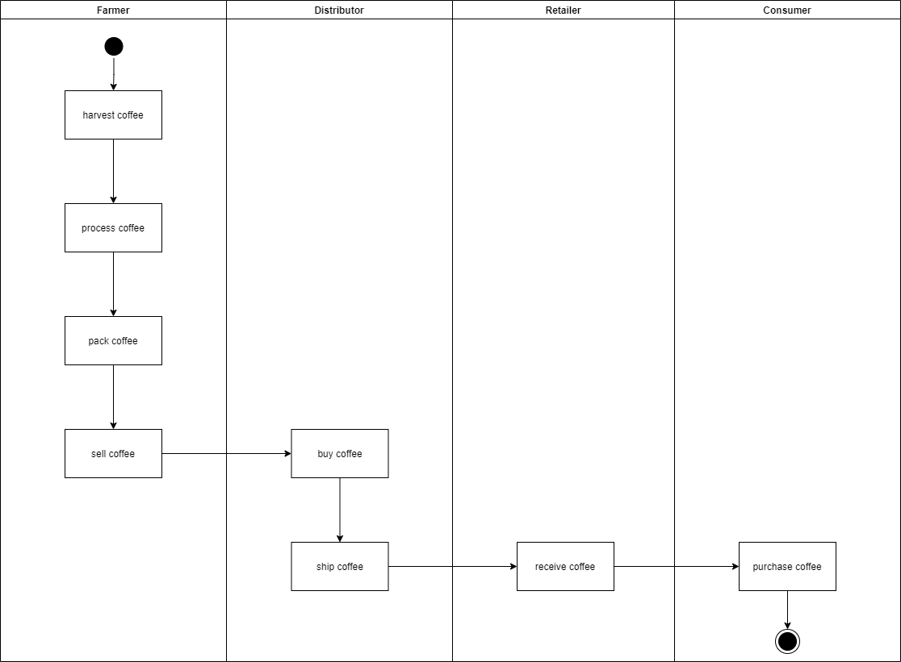
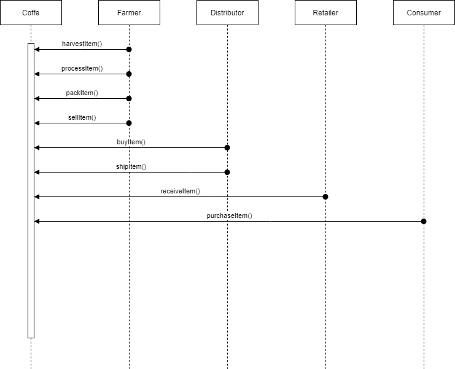
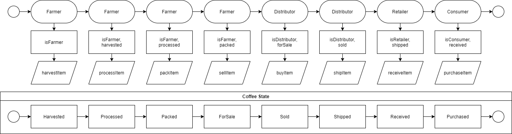
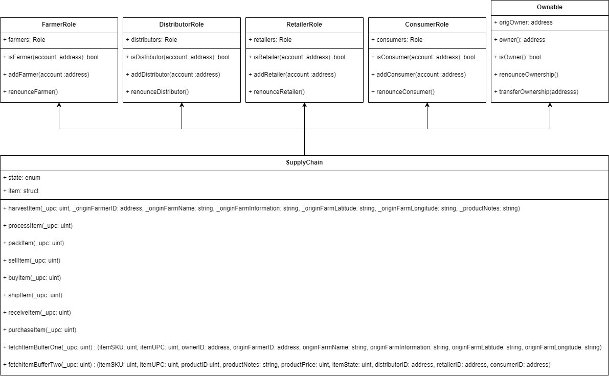

# Ethereum Dapp for Tracking Items through Supply Chain

## Project - UML Diagram

[draw.io UML diagrams](diagrams/diagrams.drawio)

### Activity

### Sequence 

### State

## Data Model

## Libraries

Made some changes to watch the emitted events, using Truffle v5 and Web3 v1.5

* @truffle/contract 4.3.38
* Truffle v5.4.14 (core: 5.4.14)
* Solidity - ^0.4.23 (solc-js)
* Node v15.6.0
* Web3.js v1.5.3

# Rinkeby Deploy

Transaction: [0xda97826ab4048d0670d603b0d9d1263e41afb48706b18457f906f6fab6e5d2b5](https://rinkeby.etherscan.io/tx/0xda97826ab4048d0670d603b0d9d1263e41afb48706b18457f906f6fab6e5d2b5)

Contract: [0xAf445c7e4bCEfd760E1a8A362B9E68750dcAfD2F](https://rinkeby.etherscan.io/address/0xAf445c7e4bCEfd760E1a8A362B9E68750dcAfD2F)

## Transaction History

* Harvested - [0x7d4007caeb28b907e2da4a1eee994980555ae3cd3e9b6280f64498ace5a5ae1d](https://rinkeby.etherscan.io/tx/0x7d4007caeb28b907e2da4a1eee994980555ae3cd3e9b6280f64498ace5a5ae1d)
* Processed - [0xaa9aa1a46d0c0a94330fedaf1fdc00ae6675b4ed6d8427e1bcc05c200ca2ad79](https://rinkeby.etherscan.io/tx/0xaa9aa1a46d0c0a94330fedaf1fdc00ae6675b4ed6d8427e1bcc05c200ca2ad79)
* Packed - [0xdb7ea34de6591eb012bd40cbbd6a25c9a9cd9e674ad53f764f44f022abd767dc](https://rinkeby.etherscan.io/tx/0xdb7ea34de6591eb012bd40cbbd6a25c9a9cd9e674ad53f764f44f022abd767dc)
* ForSale - [0xe984387270a00cfa9a57c235ce7c3005586ae950e35959814c125d63f05594db](https://rinkeby.etherscan.io/tx/0xe984387270a00cfa9a57c235ce7c3005586ae950e35959814c125d63f05594db)
* Sold - [0x9d853396a898678aa0c1d817370d3d5c3bcb8a9c00040c4bad9d4ee0f1d07a41](https://rinkeby.etherscan.io/tx/0x9d853396a898678aa0c1d817370d3d5c3bcb8a9c00040c4bad9d4ee0f1d07a41)
* Shipped - [0xa05713d5af71f388955cc8ea8033bdc56234a286999aa52f9c1d4572c656e5b2](https://rinkeby.etherscan.io/tx/0xa05713d5af71f388955cc8ea8033bdc56234a286999aa52f9c1d4572c656e5b2)
* Received - [0xca58feb03c3d4d8c1a07bd76aec2a295d51a72531df26d16e52da83846d7f023](https://rinkeby.etherscan.io/tx/0xca58feb03c3d4d8c1a07bd76aec2a295d51a72531df26d16e52da83846d7f023)
* Purchased - [0xb71354f070762bda6ebdd2e26ba3f5860a57f767a60c8925440a8b9a020d705b](https://rinkeby.etherscan.io/tx/0xb71354f070762bda6ebdd2e26ba3f5860a57f767a60c8925440a8b9a020d705b)

